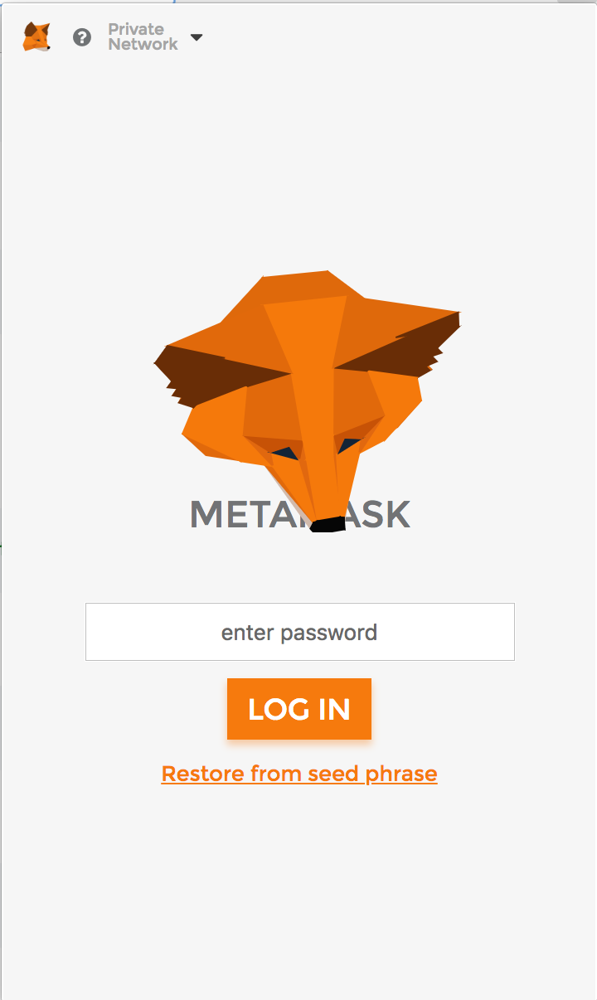
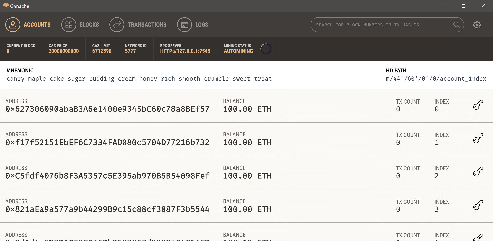
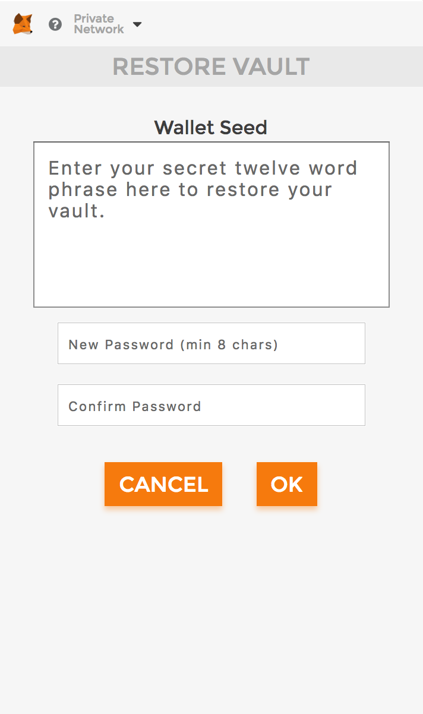
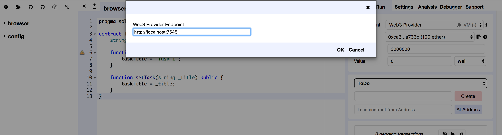
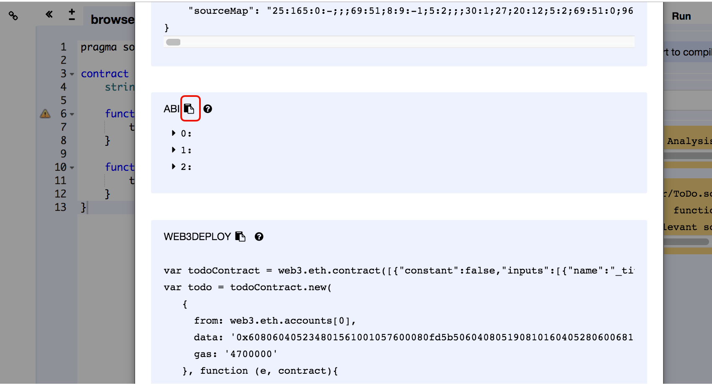
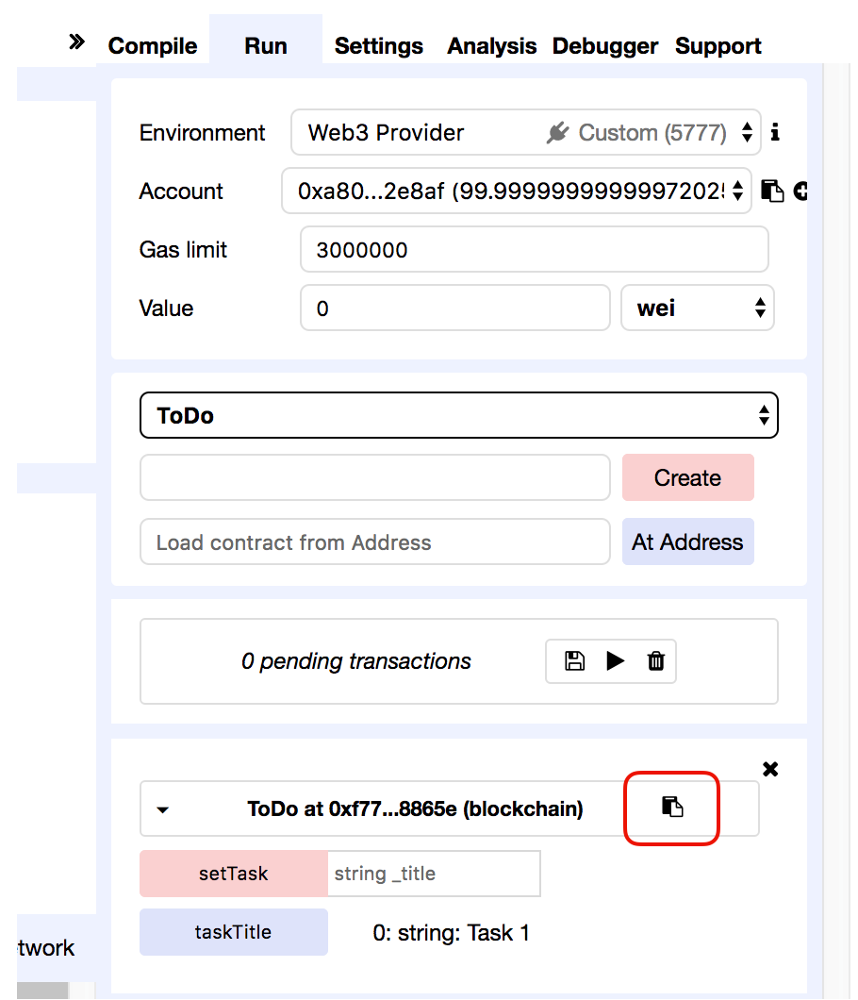

# Dapp: To Do 

- Links: 
	- [Creating a local test environment for Ethereum Smart Contracts](https://medium.com/@adamh90/creating-a-local-test-environment-for-ethereum-smart-contracts-1f638efca020)
	- [Build a Dapp in 20 Minutes, Dapp University](https://www.youtube.com/watch?v=KkZ6iYnSDRw)

## Step 0: Create a local test environment for Ethereum Smart Contracts 
- Set up MetaMask browser extension.
- Install Ganache personal Ethereum blockchain. 
- Set up MetaMask with your Ganache chain
	- Connect metamask to the blockchain created by Ganache: click on the menu that shows ‘Main Network’, select Custom RPC. Enter the following url into the “New RPC URL” box : http://localhost:7545 and click Save. The network at the top will now say “Private Network”. (Each account created by Ganache is given 100 ether. The first account should have less than the others because that account supplies the gas for smart contract deployment.)
	- Click on restore seed phase, enter the Ganache seed phase (get it from ganache) 

	

	

	

## Step 1: Setup Web3.js
- Create project folder
- Create web3.min.js file (add it to index.html)

## Step 2: Create the UI 
- Create an index.html in the project folder 
- Use bootstrap 

## Step 3: Write the contract 
- Go to https://remix.ethereum.org/
- Create a new file, ToDo.sol

## Step 4: Select environment in Remix 
- Click on the 'Run' tab, and then change the Environment dropdown to 'Web3 Provider'
- Change the endpoint to 'http://localhost:7545' (because the Ganache is running on HTTP://127.0.0.1:7545) 
- Once that is connected, you should be able to see the accounts available on Ganache 

## Step 5: Deploy the smart contract
- Select the first account 
- Click on ‘create’ 

## Step 6: Use Web3.js to connect and interact with the smart contract
- Create an empty script tag at the bottom of index.html. This is where the code to work with the smart contract will be.
- Specify a default ethereum account to use through the web3.eth.defaultAccount method (Ganache provided 10 accounts, we’re choosing the first account to use): web3.eth.defaultAccount = web3.eth.accounts[0]
- Initialize (or create) the contract on an address using the web3.eth.contract() method. This method accepts one parameter, the ABI (Application Binary Interface), which allows you to call functions and receive data from your smart contract. 
	- Grab the contract ABI: Go to the Remix IDE, click on the Compile tab and click Details. Scroll down until you see the ABI section, click on the copy icon to get the ABI. 

	
- Lastly, specify the actual contract address. 

